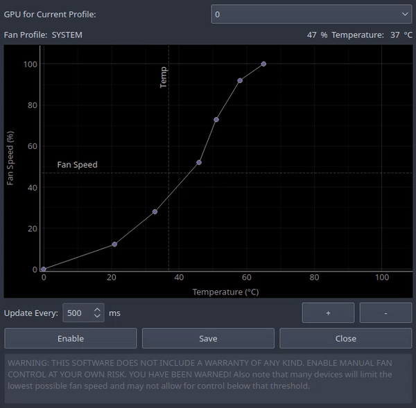

## qt-amdgpu-fan-ctl
Python script which enables a GUI controllable fan-curve for the AMDGPU driver under GNU/Linux

### License
GNU GPLv3

### Requirements
You must have SUDO abilities, and NOPASSWD:ALL for sudoers
> $USER ALL=(ALL) NOPASSWD:ALL

### Basic functionality:
- Set GPU fan curve using GUI
- Near-unlimited control points
- Save fan curve state
- Monitor GPU temperature
- Monitor GPU fan speed

### Screenshot:

### TODO:
- Handle multiple GPU fan profiles
- System information panel / window
- Better reflect SYSTEM/MANUAL control

## Known Issues:
- Fan speed InfiniteLine is offset by ~3 points
