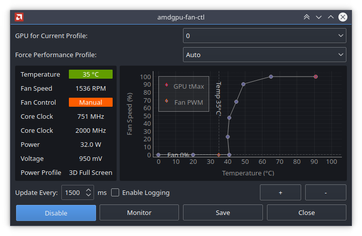

## qt-amdgpu-fan-ctl
Python script which enables a GUI controllable fan-curve for the AMDGPU driver under GNU/Linux

### License
GNU GPLv3

### Requirements
- Qt5
- Python3
- pyqtgraph
- numpy

You can either have run the script as root
> sudo python3 ./qt-amdgpu-fan-ctl.py

AND/OR

Allow SUDO with NOPASSWD:ALL for sudoers
> $USER ALL=(ALL) NOPASSWD:ALL

### Basic functionality:
- [x] Monitor GPU temperature, fan speed, power, clock speeds and more to come!
- [x] Set and save GPU fan curve with near-unlimited control points
- [ ] Handle multiple GPU fan profiles
- [ ] Monitor and set PowerPlay profile
- [ ] Overclocking Interface
- [ ] Configuration (log settings, SI units, enable/disable features like colorization, graph options)

### Screenshot:

######Screencap may differ from current build
