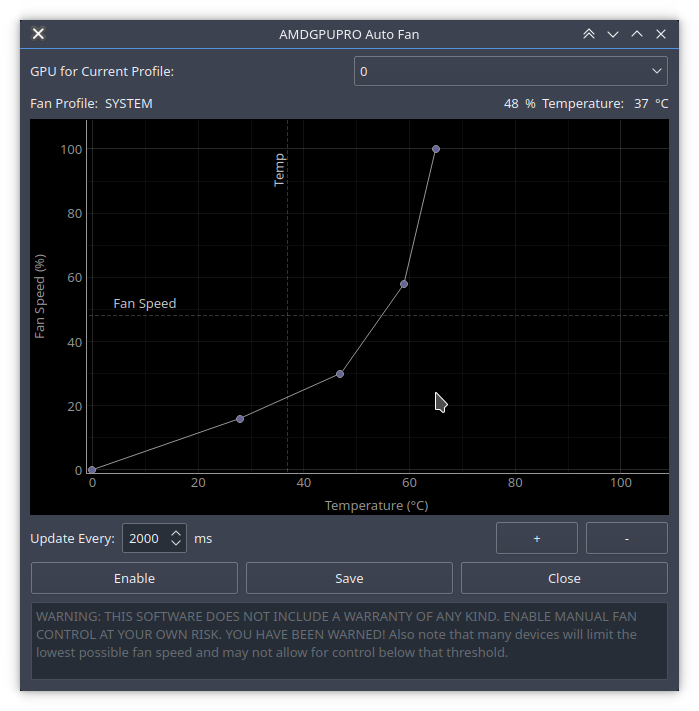

## qt-amdgpu-fan-ctl
Python script which enables a Graphical User Interface manually controllable fan-curve for the AMDGPU driver under GNU/Linux

#### License
GNU GPLv3

###### Screenshot:

###### Basic functionality:
- Set GPU fan curve using GUI
- Near-unlimited control points
- Save fan curve state
- Monitor GPU temperature
- Monitor GPU fan speed
